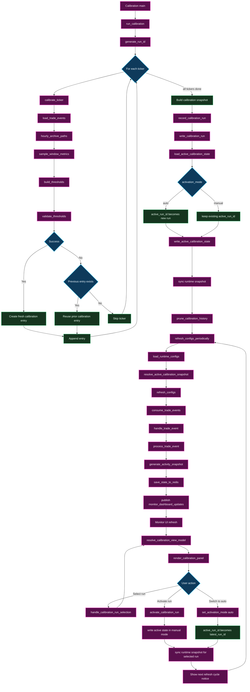

# Calibration To Monitor UI Activity

```mermaid
flowchart TD
    A[Calibration main] --> B[run_calibration]
    B --> C[generate_run_id]
    C --> D{For each ticker}

    D --> E[calibrate_ticker]
    E --> F[load_trade_events]
    F --> G[hourly_archive_paths]
    G --> H[sample_window_metrics]
    H --> I[build_thresholds]
    I --> J[validate_thresholds]

    J --> K{Success}
    K -- Yes --> L[Create fresh calibration entry]
    K -- No --> M{Previous entry exists}
    M -- Yes --> N[Reuse prior calibration entry]
    M -- No --> O[Skip ticker]

    L --> P[Append entry]
    N --> P
    O --> D
    P --> D

    D -->|all tickers done| Q[Build calibration snapshot]
    Q --> R[record_calibration_run]

    R --> S[write_calibration_run]
    S --> T[load_active_calibration_state]
    T --> U{activation_mode}
    U -- auto --> V[active_run_id becomes new run]
    U -- manual --> W[keep existing active_run_id]
    V --> X[write_active_calibration_state]
    W --> X
    X --> Y[sync runtime snapshot]
    Y --> Z[prune_calibration_history]

    Z --> AA[refresh_configs_periodically]
    AA --> AB[load_runtime_configs]
    AB --> AC[resolve_active_calibration_snapshot]
    AC --> AD[refresh_configs]

    AD --> AE[consume_trade_events]
    AE --> AF[handle_trade_event]
    AF --> AG[process_trade_event]
    AG --> AH[generate_activity_snapshot]
    AH --> AI[save_state_to_redis]
    AI --> AJ[publish monitor_dashboard_updates]

    AJ --> AK[Monitor UI refresh]
    AK --> AL[resolve_calibration_view_model]
    AL --> AM[render_calibration_panel]
    AM --> AN{User action}

    AN -- Select run --> AO[handle_calibration_run_selection]
    AO --> AL

    AN -- Activate run --> AP[activate_calibration_run]
    AP --> AQ[write active state in manual mode]
    AQ --> AR[sync runtime snapshot for selected run]
    AR --> AS[Show next refresh cycle notice]
    AS --> AA

    AN -- Switch to auto --> AT[set_activation_mode auto]
    AT --> AU[active_run_id becomes latest_run_id]
    AU --> AR

    classDef method fill:#5a0f4d,stroke:#ff5fd2,stroke-width:2px,color:#fff0fb;
    classDef state fill:#16351f,stroke:#2fbf71,stroke-width:1.5px,color:#ecfff2;
    classDef decision fill:#0e3a5b,stroke:#4fd1ff,stroke-width:2px,color:#eefaff;

    class A,B,C,E,F,G,H,I,J,R,S,T,X,Y,Z,AA,AB,AC,AD,AE,AF,AG,AH,AI,AJ,AK,AL,AM,AO,AP,AQ,AR,AS,AT method;
    class L,N,O,P,Q,V,W,AU state;
    class D,K,M,U,AN decision;
```
