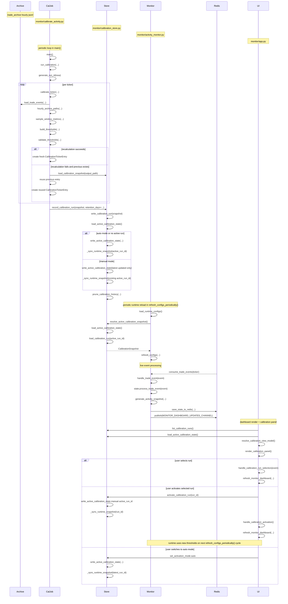

# Calibration To Monitor UI Sequence

```mermaid
sequenceDiagram
    participant Archive
    participant CalJob
    participant Store
    participant Monitor
    participant Redis as Redis
    participant UI

    Note over Archive: trade_archive hourly jsonl
    Note over CalJob: monitor/calibrate_activity.py
    Note over Store: monitor/calibration_store.py
    Note over Monitor: monitor/activity_monitor.py
    Note over UI: monitor/app.py

    Note over CalJob: periodic loop in main()

    CalJob->>CalJob: main()
    CalJob->>CalJob: run_calibration(...)
    CalJob->>CalJob: generate_run_id(now)

    loop per ticker
        CalJob->>CalJob: calibrate_ticker(...)
        CalJob->>Archive: load_trade_events(...)
        CalJob->>CalJob: hourly_archive_paths(...)
        CalJob->>CalJob: sample_window_metrics(...)
        CalJob->>CalJob: build_thresholds(...)
        CalJob->>CalJob: validate_thresholds(...)
        alt recalculation succeeds
            CalJob->>CalJob: create fresh CalibrationTickerEntry
        else recalculation fails and previous exists
            CalJob->>Store: load_calibration_snapshot(output_path)
            CalJob->>CalJob: reuse previous entry
            CalJob->>CalJob: create reused CalibrationTickerEntry
        end
    end

    CalJob->>Store: record_calibration_run(snapshot, retention_days=...)
    Store->>Store: write_calibration_run(snapshot)
    Store->>Store: load_active_calibration_state()
    alt auto mode or no active run
        Store->>Store: write_active_calibration_state(...)
        Store->>Store: _sync_runtime_snapshot(active_run_id)
    else manual mode
        Store->>Store: write_active_calibration_state(latest updated only)
        Store->>Store: _sync_runtime_snapshot(existing active_run_id)
    end
    Store->>Store: prune_calibration_history(...)

    Note over Monitor: periodic runtime reload in refresh_configs_periodically()

    Monitor->>Monitor: load_runtime_configs()
    Monitor->>Store: resolve_active_calibration_snapshot()
    Store->>Store: load_active_calibration_state()
    Store->>Store: load_calibration_run(active_run_id)
    Store-->>Monitor: CalibrationSnapshot
    Monitor->>Monitor: refresh_configs(...)

    Note over Monitor: live event processing

    Redis-->>Monitor: consume_trade_events(ticker)
    Monitor->>Monitor: handle_trade_event(event)
    Monitor->>Monitor: state.process_trade_event(event)
    Monitor->>Monitor: generate_activity_snapshot(...)
    Monitor->>Redis: save_state_to_redis(...)
    Monitor->>Redis: publish(MONITOR_DASHBOARD_UPDATES_CHANNEL)

    Note over UI: dashboard render + calibration panel

    UI->>Store: list_calibration_runs()
    UI->>Store: load_active_calibration_state()
    UI->>UI: resolve_calibration_view_model()
    UI->>UI: render_calibration_panel()

    alt user selects run
        UI->>UI: handle_calibration_run_selection(event)
        UI->>UI: refresh_monitor_dashboard(...)
    else user activates selected run
        UI->>Store: activate_calibration_run(run_id)
        Store->>Store: write_active_calibration_state manual active_run_id
        Store->>Store: _sync_runtime_snapshot(run_id)
        UI->>UI: handle_calibration_activation()
        UI->>UI: refresh_monitor_dashboard(...)
        Note over Monitor,UI: runtime uses new thresholds on next refresh_configs_periodically() cycle
    else user switches to auto mode
        UI->>Store: set_activation_mode auto
        Store->>Store: write_active_calibration_state(...)
        Store->>Store: _sync_runtime_snapshot(latest_run_id)
    end
```
