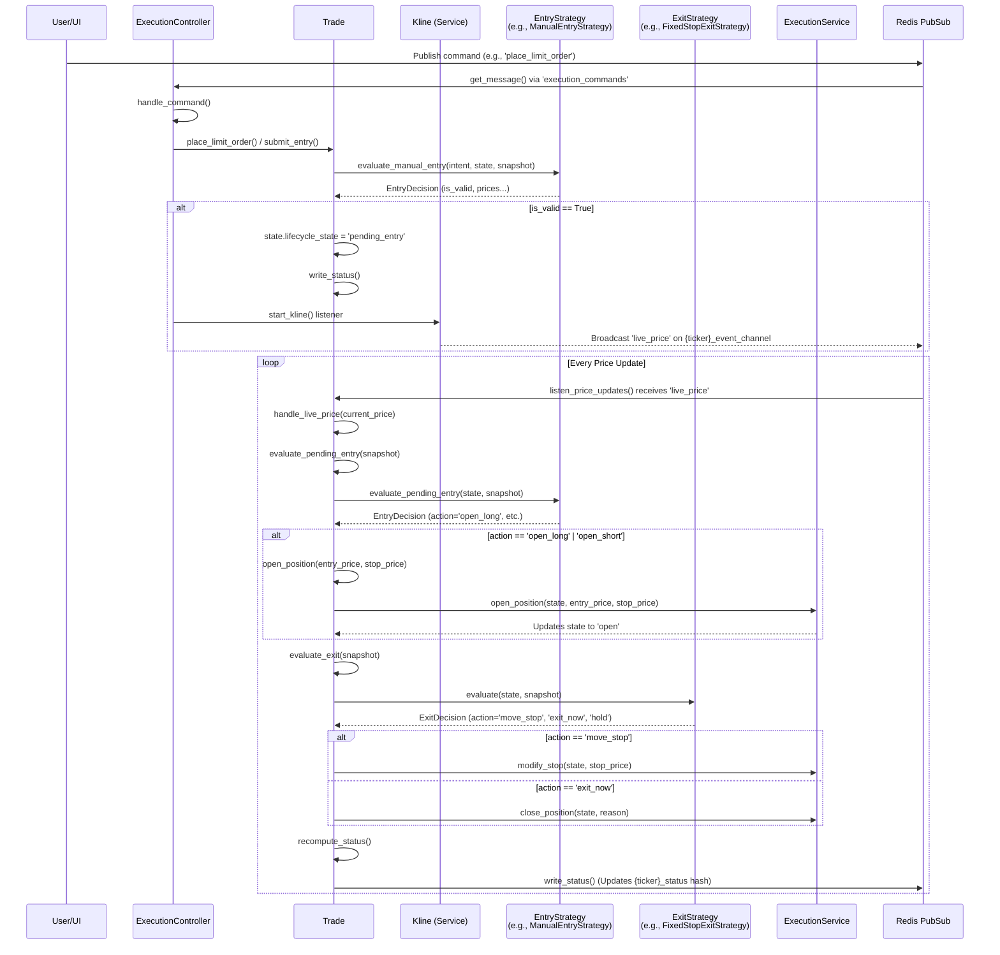

# Trade Execution Flow Visualization

This document outlines the end-to-end execution flow of the `Ritrade` trading system, centered around the `ExecutionController`, `Trade` service, and modular strategies.

## Overview of the Flow

1. **Commands & Interaction:** The entry point for trade actions is the `ExecutionController`, which listens for JSON commands via a Redis channel.
2. **Strategy Evaluation:** When placing orders, checking for entry triggers, or managing an open position, the `Trade` class delegates the logic to an `EntryStrategy` or `ExitStrategy`.
3. **Price Monitoring:** Once a trade is initialized, the `Trade` class runs a background thread `listen_price_updates()` that listens to a localized redis event channel for tick/kline data.
4. **State Actuation:** State changes representing executed actions are eventually passed to the `ExecutionService` and written back out to Redis for the UI.

## Mermaid Visualization

## Key Classes & Methods

### 1. `ExecutionController` (`execute/breakout/main.py`)
- **`run()`**: Subscribes to `COMMAND_CHANNEL` (`execution_commands`) and polls for user commands (e.g. from the UI).
- **`handle_command(command)`**: Routes valid commands (`pin_ticker`, `place_limit_order`, `cancel_order`, `close_position`) to the specific ticker's `Trade` object.
- **`start_kline(ticker)`**: Spawns a listening task for `Kline` to start streaming data.

### 2. `Trade` (`execute/services/trade.py`)
This is the core engine for an individual ticker's runtime execution.
- **`start()` / `listen_price_updates()`**: Starts a daemon thread listening on `{ticker}_event_channel` for incoming `live_price` ticks over Redis.
- **`submit_entry(position_type, limit_price)`**: Calls the `EntryStrategy.evaluate_manual_entry()` to see if an order is valid, then transitions the system to `pending_entry`.
- **`handle_live_price(current_price)`**: The heartbeat of the active system. Triggers both `evaluate_pending_entry()` (to handle fills) and `evaluate_exit()` (to handle stops or targets).
- **`evaluate_pending_entry(snapshot)`**: Queries `EntryStrategy` to see if the limit order criteria has been triggered by price action. If true, calls `open_position()`.
- **`evaluate_exit(snapshot)`**: Queries `ExitStrategy` to see if a stop loss was hit or needs to be trailed. If so, calls the `ExecutionService` to update the state.
- **`write_status()`**: Computes PnL/metrics via `PnLCalculator` and writes the `TradeState` out to Redis (`{ticker}_status`).

### 3. `ExecutionService` (`execute/services/execution.py`)
A thin actuator that isolates the actual state updates of the `TradeState` from the evaluation logic.
- **`open_position()`**: Flips the lifecycle state to `open` and locks in the `entry_price`.
- **`close_position()`**: Changes state to `closed` and clears order information.
- **`modify_stop()`**: Updates `stop_price` when strategies demand trailing stops.

### 4. `Strategy Interfaces` (`execute/strategy/base.py`)
- **`EntryStrategy`**: Has `evaluate_manual_entry()` (checks if limit/manual condition is safe) and `evaluate_pending_entry()` (triggers open_position if price hits the limit).
- **`ExitStrategy`**: Has `evaluate()` which continuously monitors an open position and returns an `ExitDecision` containing an action (e.g. `move_stop`, `exit_now`).
