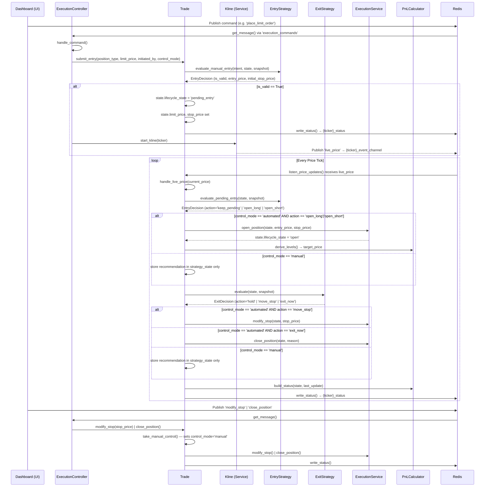

# Trade Execution Flow

End-to-end execution flow of the `Ritrade` trading system, centered around `ExecutionController`, `Trade`, and the modular strategy layer.

## Overview

1. **Commands:** The dashboard publishes JSON commands to `execution_commands`. `ExecutionController` consumes them and routes to the relevant `Trade` instance.
2. **Strategy evaluation:** Entry and exit logic is delegated to `EntryStrategy` / `ExitStrategy` implementations. The `Trade` class never contains strategy logic directly.
3. **Control mode:** If `control_mode='manual'`, strategy decisions are stored as recommendations but not acted on — the human confirms via the dashboard. If `'automated'`, decisions execute immediately.
4. **Price monitoring:** Each `Trade` runs a background thread (`listen_price_updates`) subscribed to `{ticker}_event_channel`. Every price tick triggers entry fill checks and exit evaluation.
5. **State actuation:** `ExecutionService` applies state changes to `TradeState`. `PnLCalculator.build_status()` serializes the result to the `{ticker}_status` Redis hash for the dashboard to read.

---

## Sequence Diagram

---

## Key Classes & Methods

### `ExecutionController` (`execute/breakout/main.py`)

- **`run()`** — subscribes to `execution_commands` and polls for incoming commands
- **`handle_command(command)`** — routes commands (`pin_ticker`, `unpin_ticker`, `place_limit_order`, `cancel_order`, `close_position`, `modify_stop`) to the ticker's `Trade` object
- **`get_trade(ticker)`** — lazily creates a `Trade` with injected `ManualEntryStrategy` + `FixedStopExitStrategy`
- **`start_kline(ticker)`** / **`stop_kline(ticker)`** — manages `Kline` WebSocket lifecycle per ticker

### `Trade` (`execute/services/trade.py`)

Core orchestrator for a single ticker's runtime.

- **`start()`** — begins the price listener thread and publishes initial status
- **`listen_price_updates()`** — daemon thread subscribed to `{ticker}_event_channel`; routes ticks to `handle_live_price()`
- **`submit_entry(position_type, limit_price, *, initiated_by, control_mode)`** — validates via `EntryStrategy.evaluate_manual_entry()`, transitions to `pending_entry`
- **`handle_live_price(price)`** — heartbeat: triggers `evaluate_pending_entry()` + `evaluate_exit()` + `write_status()`
- **`evaluate_pending_entry(snapshot)`** — delegates fill check to `EntryStrategy`; in automated mode calls `open_position()` on fill
- **`evaluate_exit(snapshot)`** — delegates stop/target check to `ExitStrategy`; in automated mode calls `ExecutionService` to act
- **`take_manual_control()`** / **`release_manual_control()`** — switch `control_mode`; all manual dashboard actions seize control automatically
- **`write_status()`** — serializes current `TradeState` via `PnLCalculator.build_status()` into `{ticker}_status` hash

### `TradeState` (`execute/models/trade_runtime.py`)

Pydantic model holding all runtime state for one ticker.

Key fields: `lifecycle_state`, `control_mode`, `initiated_by`, `manual_override_active`, `strategy_state`, `entry_decision`, `exit_decision`, `decision_reason`, `limit_price`, `entry_price`, `stop_price`, `target_price`, `pnl`, `zone`.

`strategy_state` dict holds: `stop_mode`, and when in manual control, `entry_recommendation` / `exit_recommendation` dicts from the strategies.

### `ExecutionService` (`execute/services/execution.py`)

Thin actuator — isolates `TradeState` mutation from strategy and lifecycle logic.

- **`open_position(state, entry_price, stop_price)`** — sets `lifecycle_state='open'`, locks in `entry_price`
- **`close_position(state, reason)`** — sets `lifecycle_state='closed'`, clears limit
- **`modify_stop(state, stop_price, reason)`** — updates `stop_price`

### Strategy Interfaces (`execute/strategy/base.py`)

- **`EntryStrategy`** — `evaluate_manual_entry(intent, state, snapshot)` + `evaluate_pending_entry(state, snapshot)` → `EntryDecision`
- **`ExitStrategy`** — `evaluate(state, snapshot)` → `ExitDecision`

**Implementations:**

| Class | File | Logic |
|---|---|---|
| `ManualEntryStrategy` | `strategy/manual_entry.py` | Validates entry against `TradeState`; derives stop/target via `PnLCalculator`; checks if price has crossed the limit on pending fill |
| `FixedStopExitStrategy` | `strategy/fixed_stop.py` | Returns `exit_now` when price crosses `stop_price`; `hold` otherwise |

### `PnLCalculator` (`execute/services/pnl_calculator.py`)

Pure math — no side effects.

- **`derive_levels(...)`** — computes `stop_price` and `target_price` from entry price + risk/reward %
- **`calculate_floating_pnl(...)`** — floating P&L in quote currency
- **`build_status(state, last_update)`** — builds `PriceLevels` model for Redis serialization

### `Kline` (`execute/services/kline.py`)

- Connects to Binance `@kline_1m` WebSocket per ticker
- Publishes `{"live_price": <float>}` to `{ticker}_event_channel` on every tick
- **`stop()`** — publishes `shutdown_listener` sentinel and cancels the asyncio task for clean shutdown
