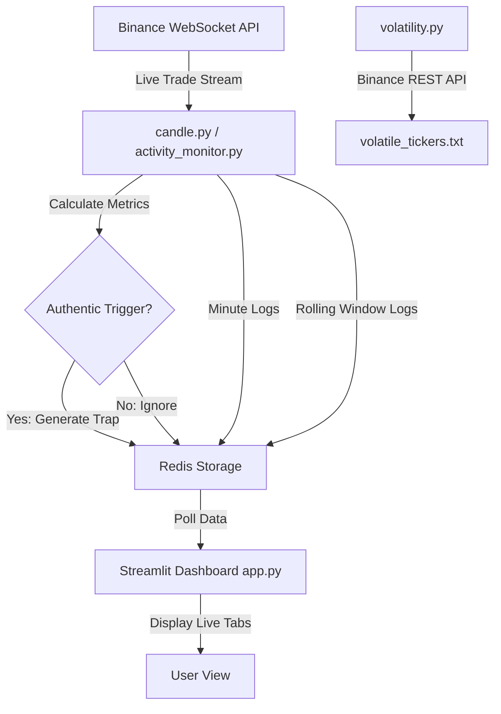

# Ritrade Codebase Walkthrough

This walkthrough explains the architecture, strategy, and key components of the **Ritrade** project. The code implements an automated cryptocurrency trading system that uses a **volatility trap strategy** on 1-minute candles. It pairs a backend trading engine with a real-time Streamlit dashboard for live monitoring.

## 1. Core Strategy: Volatility Trap

The bot continuously monitors the live trade stream from Binance via WebSockets. It doesn't use simple indicators like moving averages; instead, it looks at the **micro-structure** of the market within a 1-minute or 10-second rolling window.

> [!NOTE]
> **What is a "Volatility Trap"?** 
> The bot identifies authentic ("real") momentum by looking at trade frequency, standard deviation of prices, and volume. If the momentum is real, it places limit orders ("traps") exactly at the 20-second mark of a candle to capitalize on the expected price action, aiming for a quick fill.

The decision-making process for a "trap" relies on three key metrics:
- **Authentic Volume:** Is the volume organically distributed or manipulated by huge single trades? 
- **Standard Deviation (Volatility):** Is the price actually moving enough to trigger a trap?
- **Trade Frequency:** Are there enough individual trades to confirm participation?

## 2. Architecture Diagram

The system uses a decoupled architecture where the python engine processes real-time WebSocket data from Binance and pushes logs to a local Redis server. A Streamlit app then polls Redis to display the dashboard in real-time.

## 3. Key Components Breakdown

### The Trading Engines
There are two main engine files handling data streams:
- [candle.py](file:///Users/yogesh/Documents/Ritrade/candle.py): The primary engine. It listens to the Binance WebSocket trade stream for a specific ticker (e.g., BTCUSDC). It splits time into 10-second "buckets" and full 1-minute "master" windows. Exactly at the 20-second mark of each minute, it evaluates the data and triggers a trap log if the conditions are met.
- [activity_monitor.py](file:///Users/yogesh/Documents/Ritrade/activity_monitor.py): A variation of the engine that uses a continuous **rolling 10-second window** rather than fixed buckets. It continuously generates metrics and triggers traps based on dynamic factors.

### Real-Time Dashboard
- [app.py](file:///Users/yogesh/Documents/Ritrade/app.py): A modern Streamlit dashboard that automatically refreshes every 1 second. It reads `trap_logs`, `minute_logs`, and `rolling_metrics_logs` from Redis and displays them in clear data tables organized by tabs.

### Volatility & Signal Analysis
- [volatility.py](file:///Users/yogesh/Documents/Ritrade/volatility.py): A scanner script that hits the Binance REST API for the top 20 USDT pairs. It scores them based on recent price change, quote volume, and spread penalty. The highest-scoring assets are saved to `volatile_tickers.txt` for the bot to trade.
- [signal_score.py](file:///Users/yogesh/Documents/Ritrade/signal_score.py): Contains the `compute_micro_signal_score()` function. It takes a pandas DataFrame of price and volume data and yields a 0-100 score based on Buy/Sell ratio (50%), Momentum (30%), and Bid-Ask Spread efficiency (20%).

## 4. Typical Execution Flow

1. You run `python volatility.py` to identify the most volatile pairs right now.
2. The Redis server runs locally (port 6379).
3. The engine (`python candle.py` or `python activity_monitor.py`) is started. It connects to Binance, initializes Redis, and begins processing thousands of micro-trades.
4. You run `streamlit run app.py` to watch the data live in your browser.
5. The `candle.py` engine publishes the metrics (Average Price, Weighted Average Price (WAP), Standard Deviation, Slope, Volumes) directly into Redis keys as JSON.
6. The Streamlit app pulls these JSONs and parses them into Pandas DataFrames for visualization.

> [!TIP]
> **Understanding the normalization logic:** In `candle.py`, the `normalize_value` boundary logic clamps variables (like volume or trade counts) between predefined 20th and 80th percentiles. This prevents outlier whale trades from instantly triggering false signals.

## 5. Next Steps for Development

Since this was written a while ago, here are things to consider if you plan to update or extend the bot:
- **Order Execution:** The codebase currently *calculates* traps and logs them to Redis. Actual order placement logic (e.g., sending the limit orders back to the Binance API) seems to be pending or handled elsewhere (perhaps in `target.py` or `vbout.py`).
- **Async Efficiency:** Ensure your Python environment is modern (3.9+). `asyncio` is used heavily; utilizing modern `websockets` library practices will ensure the streams don't drop.
- **Backtesting:** The `simulations/` directory contains `bracketing_income.py` which looks useful for backtesting these limits offline before going live.
